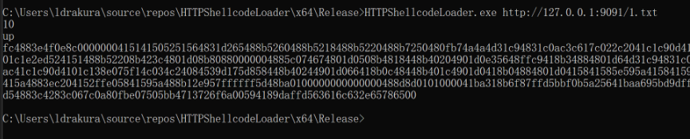
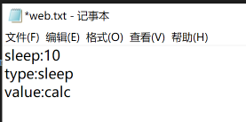
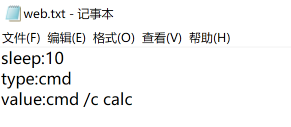
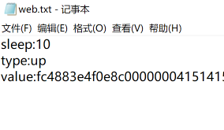
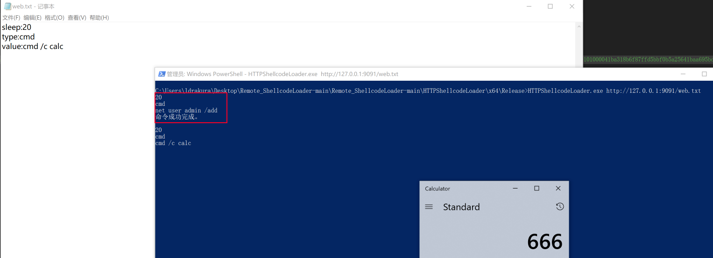
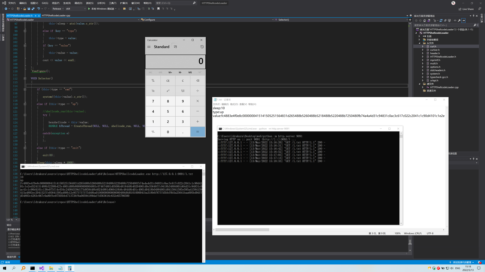

# Remote ShellCode Loader

## 声明

本文所采用技术，仅用来实现自定义功能，适用场景仅为授权的测试中进行权限维持或为个人电脑添加定制化功能，如：启动开机时启动计算机器，方便实用~

***本文仅限技术研究与讨论，严禁用于非法用途，否则产生的一切后果自行承担。**

## 背景

​	在公司打下来域控，用了一种好玩的方法做了权限维持（只要我进程不存在，你就永远也不知道我在哪）。

​	特征极少，绕过了杀软，hids，nids，后门存活了两个多月。最终在威胁情报上遭遇了滑铁卢。

​	控制端C2是有几条威胁情报的，结合NIDS的流量，情报介入以后，异常外连直接被发现。于是诞生了这个工具（只要我不连接C2，威胁情报就永远发现不了我）

​	此处仅提供思路，可和DLL劫持、其他维权手段结合。在红蓝对抗的时候，能多一个选择~

## 使用

编译测试环境：

- WIN10 1909

- VS2019

./loader url



~~当然，你可以下载源码把url硬编码在代码中，这样连命令行特征都没有了。~~

## 功能

 ```yaml
 远端配置文件：
 sleep:10
 type:cmd
 value:cmd /c calc
 ```

- sleep: 休眠时间，下次获取服务端配置间隔（单位：秒）

- type: 有sleep、cmd、up、exit四种

  ​	~~value必填项，还没处理到这块，不需要value的随便填啥都可以~~

  - sleep	不执行任何操作。

    

  - cmd     执行命令 value 为要执行的命令。

    

  - up        执行shellcode上线 value为shellcode bin的16进制

    

  - exit      退出进程。

    

## 场景

我需要做隐蔽的权限维持，机器暂时不用，需要的时候上线。~~或者某些cdn上，比如，能上传txt的地方。。。~~

可以把配置文件丢github上，设一个4小时的sleep，需要的时候，修改配置文件

- 执行命令添加用户。

  

- 上线CobaltStrike

  


## 问题

已知问题

- 加载shellcode后创建线程执行，但是beacon退出后会exit整个进程（cmd方式无此问题）

  好像和CobaltStrike Beacon退出方式有关

- 仅支持X64

- 最后一行不能包含空格，因为是根据\n与\r判断换行符。在某些场景下，会出现问题。

- 没有经过严格测试，有bug


  

## ~~TODO~~

- [x] 接受带空格的命令【已支持】
- [ ] ~~线程退出后不影响进程~~


## 参考

https://github.com/curl/curl
